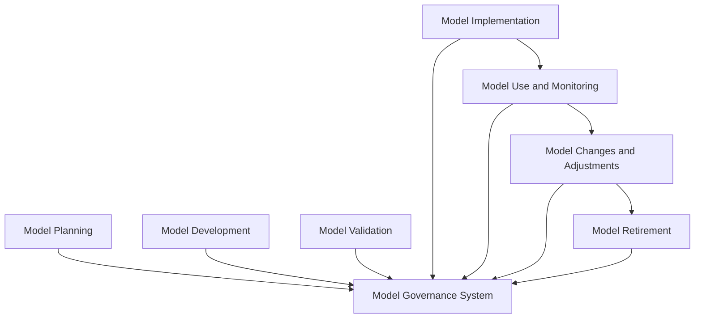
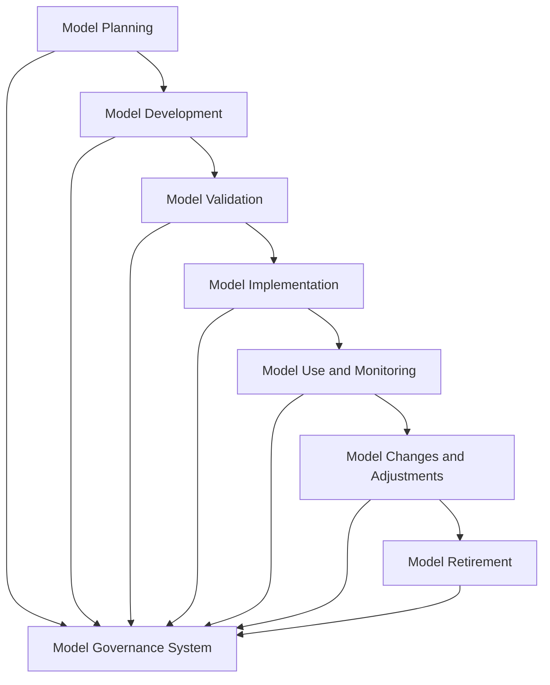
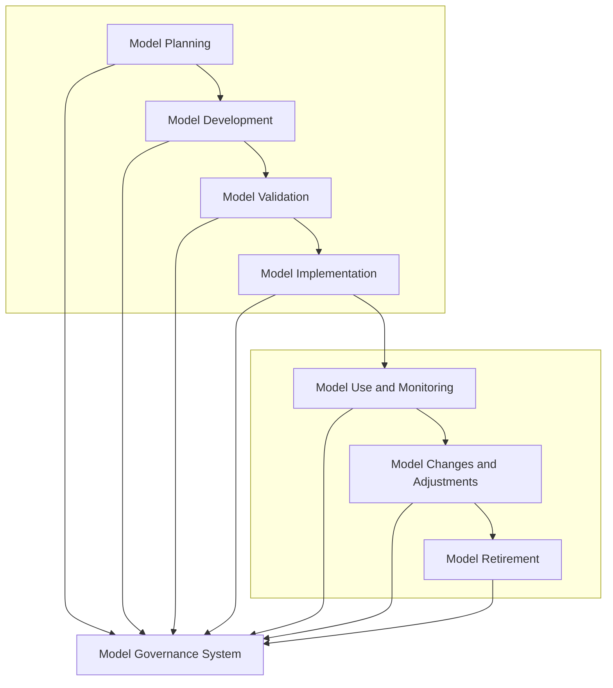

```mermaid
flowchart TD
    %% Top Row: Model Lifecycle
    subgraph "TOP: Model Lifecycle"
        direction LR
        A[Model Planning] --> B[Model Development] --> C[Model Validation] --> D[Model Implementation]
    end

    %% Middle Row: Governance Layer
    subgraph "MID: Governance Layer"
        direction LR
        G[Model Governance System]
    end

    A --> G
    B --> G
    C --> G
    D --> G

    %% Bottom Row: Post-Deployment Lifecycle
    subgraph "BOTTOM: Post-Deployment Lifecycle"
        direction LR
        U[Model Use and Monitoring] --> M[Model Changes and Adjustments] --> R[Model Retirement]
    end

    D --> U
    U --> G
    M --> G
    R --> G
 ```

```mermaid
flowchart TD
    %% Left Column: Governance Layer (Vertical Bar)
    subgraph "Model Governance System"
        direction TB
        G[Governance]
    end

    %% Top Row: Model Lifecycle
    subgraph "TOP: Model Lifecycle"
        direction LR
        A[Model Planning] --> B[Model Development] --> C[Model Validation] --> D[Model Implementation]
    end

    %% Bottom Row: Post-Deployment Lifecycle
    subgraph "BOTTOM: Post-Deployment Lifecycle"
        direction LR
        U[Model Use and Monitoring] --> M[Model Changes and Adjustments] --> R[Model Retirement]
    end

    %% Connections to Governance
    G --> A
    G --> B
    G --> C
    G --> D
    G --> U
    G --> M
    G --> R

    D --> U
 ```
```mermaid
 flowchart TD
    %% Left Column: Governance Layer (Vertical Bar)
    subgraph GOV[Model Governance System]
        direction TB
        G[Governance]
    end

    %% Top Row: Model Lifecycle
    subgraph "TOP: Model Lifecycle"
        direction LR
        A[Model Planning] --> B[Model Development] --> C[Model Validation] --> D[Model Implementation]
    end

    %% Bottom Row: Post-Deployment Lifecycle
    subgraph "BOTTOM: Post-Deployment Lifecycle"
        direction LR
        U[Model Use and Monitoring] --> M[Model Changes and Adjustments] --> R[Model Retirement]
    end

    %% Positioning governance left of all nodes using invisible edges
    G -.-> A
    G -.-> U

    %% Connect governance to each stage
    G --> A
    G --> B
    G --> C
    G --> D
    G --> U
    G --> M
    G --> R

    D --> U
 ```

```mermaid
flowchart TD
    %% Top Center: Model Governance
    G[Model Governance System]

    %% Full Lifecycle Container
    subgraph "MODEL LIFECYCLE"
        direction LR

        %% Left Side: Pre-Launch Lifecycle
        subgraph "PRE: Pre-Launch"
            direction TB
            A[Model Planning] --> B[Model Development] --> C[Model Validation] --> D[Model Implementation]
        end

        %% Right Side: Post-Launch Lifecycle
        subgraph "POST: Post-Launch"
            direction TB
            U[Model Use and Monitoring] --> M[Model Changes and Adjustments] --> R[Model Retirement]
        end
    end

    %% Connections
    G --> A
    G --> U
    R --> G
    D --> U
 ```
