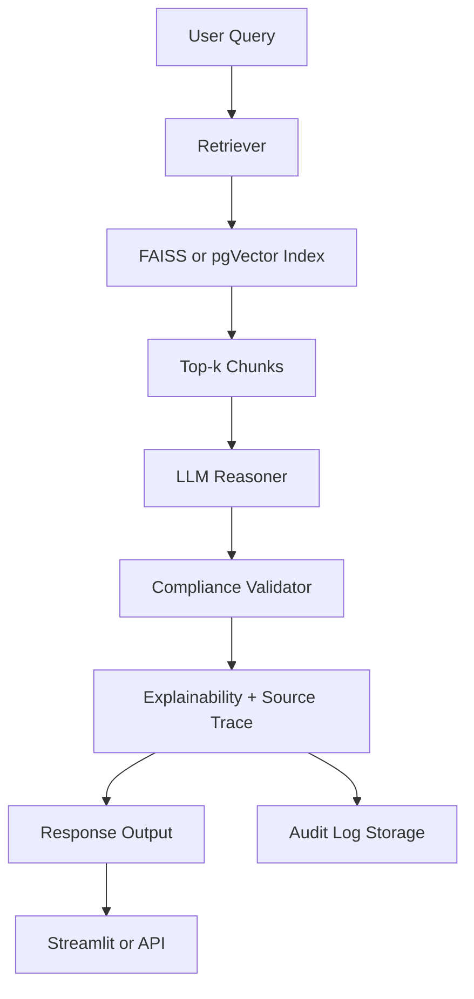

## 📘 **Cookbook System Recipe: Regulatory RAG QA System**

### 🏷️ Title:

**“Ask the Regulator”: A Retrieval-Augmented Compliance QA Agent for Financial Services**

---

### 🎯 **Goal:**

Build a Retrieval-Augmented Generation (RAG) system that lets analysts and compliance officers ask natural language questions about internal policies, KYC/AML rules, and financial regulations — and get **precise, explainable, and auditable answers**.

---

### 🧩 **System Components**

| Component                 | Purpose                                                                  |
| ------------------------- | ------------------------------------------------------------------------ |
| **Document Ingestor**     | Converts financial regulations, policies, and procedures into embeddings |
| **Vector Store**          | Stores embedded knowledge (e.g., FAISS or pgVector)                      |
| **Retriever**             | Retrieves relevant chunks for each query                                 |
| **LLM Reasoner**          | Generates responses using retrieved context                              |
| **Compliance Validator**  | Checks responses for scope and regulatory phrasing                       |
| **Explainability Engine** | Outputs trace of retrieved sources + reasoning steps                     |
| **Audit Logger**          | Stores queries, responses, sources, timestamps                           |
| **Frontend / API**        | Interface for analysts and auditors                                      |

---

### 🖼️ **System Architecture Diagram (Mermaid)**



---

### ⚙️ **Setup Guide**

#### **1. Document Preparation**

* Collect internal policies, KYC rules, regulatory PDFs (e.g., SR 11-7, GDPR, BSA)
* Use PDF parsers (`PyMuPDF`, `PDFPlumber`) to extract clean text
* Preprocess into structured paragraphs with metadata

#### **2. Embedding + Vector Indexing**

* Use `Bedrock Titan`, `OpenAI`, or `Cohere` for embedding
* Chunk documents into passages (100–300 tokens)
* Store using `FAISS` (S3-persisted) or `pgVector`

#### **3. Retrieval Logic**

* Implement a retriever module (e.g., using `LangChain` or `DSPy Retriever`)
* Add metadata filters: policy\_type, source\_doc, date

#### **4. LLM Response Generation**

* Use chain-of-thought prompting:

  ```
  Given the following policies, explain in plain English the requirement for...
  ```
* Return response + quoted sources

#### **5. Compliance Layer**

* Enforce mandatory phrasing (e.g., "This does not constitute legal advice")
* Optional: use regex/LLM classifier to flag non-compliant terms

#### **6. Explainability Layer**

* Append:

  * Retrieved chunk IDs and document titles
  * Embedded similarity scores
  * LLM thought trace (if using DSPy or ReAct)

#### **7. Logging & Audit Trail**

* Store:

  * Query
  * LLM response
  * Retrieval results
  * Timestamps, user ID
* Use: `S3`, `DynamoDB`, or `pgVector` as backend

#### **8. Interface Options**

* **Streamlit**: For internal compliance teams
* **FastAPI**: For enterprise integration
* **Slack Bot**: Lightweight corporate tool

---

### 🧪 **Testing Checklist**

| Test Case                              | Outcome                                  |
| -------------------------------------- | ---------------------------------------- |
| Ask: "What’s the required ID for KYC?" | Should return source from KYC policy     |
| Ask: "Who approves AML exceptions?"    | Should cite AML doc + approval workflow  |
| Ask a trick question                   | Returns “Policy not found” or disclaimer |
| Retrieve edge case (e.g., 2019 rules)  | Filters correctly using metadata         |

---

### 🛠️ **Tools & Technologies**

| Tool / Lib            | Use Case                            |
| --------------------- | ----------------------------------- |
| **LangChain / DSPy**  | Agent chaining, prompt structuring  |
| **FAISS / pgVector**  | Vector search backend               |
| **Bedrock / OpenAI**  | Embedding + LLM reasoning           |
| **Streamlit / Flask** | Frontend or API                     |
| **Pydantic**          | Validation of audit logs and inputs |

---

### 🧠 **Tips for Deployment**

* Use **S3-persisted FAISS** for reproducibility in regulated environments
* Add **metadata filtering** to isolate specific regulation types
* Use **Amazon CloudWatch**, **Datadog**, or your firm’s audit tool to track logs
* Offer **“Why was this answer chosen?”** buttons for transparency

---

### 📦 **Output Example**

**Input:**

> *"What documentation is required for onboarding a new institutional client?"*

**Output:**

> According to our 2023 KYC onboarding policy, the following documents are required:
>
> * Legal entity certificate
> * Proof of beneficial ownership
> * Tax documentation (Form W-9/W-8BEN-E)
>
> *Source: “KYC\_Onboarding\_Policy\_v2023.pdf”, Section 4.2*
>
> *\[This answer is provided for internal compliance review purposes only.]*
